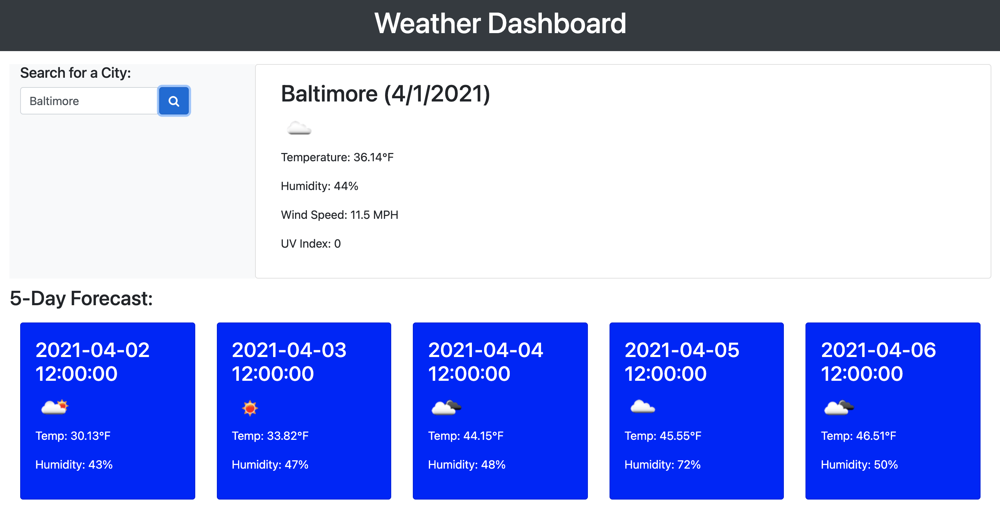

# Weather Dashboard

The following is a weather dashboard that allows a user to search a city, and view the city's current weather (temperature, humidity, wind speed, and UV index) as well as view the city's 5-day forecast including the same information (temperature, humidity, wind speed, and UV index).

Link to Weather Dashboard: https://caitbopp.github.io/weather-dashboard/

Preview of Weather Dashboard: 

